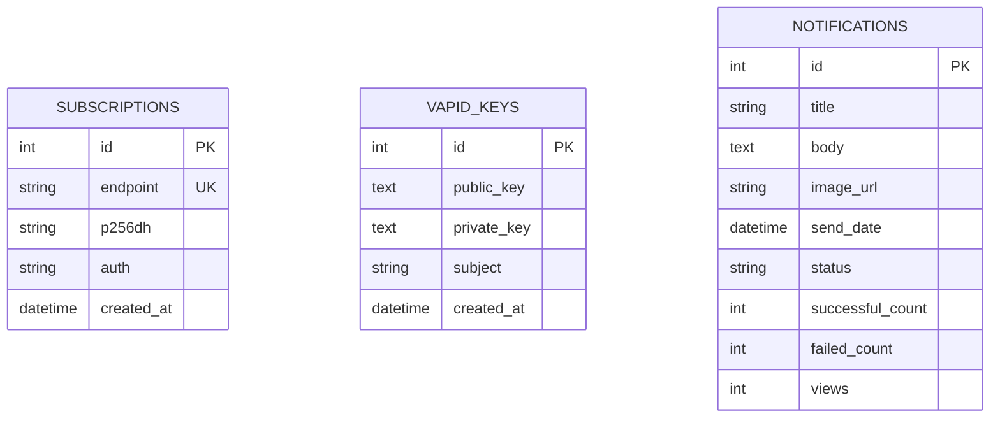

<p align="center">
  <h1 align="center">🔔 WebPushNotify</h1>
  <p align="center">
    <strong>A learning project to understand & demonstrate how web push notifications work 🚀</strong>
  </p>
  <p align="center">
    <a href="#-features">Features</a> •
    <a href="#-tech-stack">Tech Stack</a> •
    <a href="#-getting-started">Getting Started</a> •
    <a href="#-api-reference">API Reference</a> •
    <a href="#-deployment">Deployment</a> •
    <a href="#-project-structure">Project Structure</a>
  </p>
</p>

<p align="center">
  
  
  
  
  
  
  
  
</p>

---

## 📝 Overview

**WebPushNotify** is a hobby project I built to learn and demonstrate how **web push notifications** actually work under the hood, from the **VAPID protocol** and **service workers** to managing subscriptions and delivering payloads. It's not meant to be a production-grade service, just a hands-on way to explore the Web Push API by building a real, working app around it but it ended up growing into a full-stack app with a **FastAPI** backend, a **React + Vite** frontend, an admin dashboard, scheduled notifications, subscriber management, and even **PWA** support.📚

> 💡 If you're curious about how browser push notifications work from scratch, feel free to dig into the code, break things, and learn along the way!

---
⭐ Star this repo if you find it useful!

## ✨ Features

| Feature | Description |
|---|---|
| 🚀 **Instant & Scheduled Push** | Send notifications immediately or schedule them for a future date/time |
| 🔑 **VAPID Key Management** | Generate or import VAPID keys directly from the admin panel |
| 👥 **Subscriber Management** | View, track, and bulk-import push subscribers |
| 📊 **Notification Analytics** | Track delivery success/failure counts and notification view metrics |
| 🛡️ **Admin Authentication** | Secure admin panel protected with a secret key |
| 📱 **PWA Support** | Installable as a Progressive Web App on any device |
| ⏰ **Job Scheduling** | APScheduler-powered background jobs for scheduled notifications |
| 🔄 **Resilience Check** | Automatically reschedules pending notifications on server restart |
| 🧹 **Auto Cleanup** | Expired/invalid subscriptions are automatically pruned (404/410) |
| 🐳 **Docker Ready** | One-command deployment with Docker Compose |
| 🖼️ **Image Notifications** | Attach images to your push notifications |
| 📋 **Notification History** | Paginated history with status filtering (sent, pending, failed) |

---

## 🛠️ Tech Stack

### Frontend
| Technology | Purpose |
|---|---|
| ⚛️ [React 19](https://react.dev/) | UI framework |
| ⚡ [Vite 7](https://vite.dev/) | Build tool & dev server |
| 🧭 [React Router v7](https://reactrouter.com/) | Client-side routing |
| 📱 [vite-plugin-pwa](https://vite-pwa-org.netlify.app/) | PWA & service worker |
| 🎨 Vanilla CSS | Custom styling with animations |

### Backend
| Technology | Purpose |
|---|---|
| 🐍 [FastAPI](https://fastapi.tiangolo.com/) | REST API framework |
| 🗃️ [SQLAlchemy](https://www.sqlalchemy.org/) | ORM & database management |
| 📦 [SQLite](https://www.sqlite.org/) | Lightweight database |
| 🔔 [pywebpush](https://github.com/web-push-libs/pywebpush) | Web Push Protocol |
| 🔐 [py-vapid](https://github.com/web-push-libs/vapid) | VAPID key generation |
| ⏱️ [APScheduler](https://apscheduler.readthedocs.io/) | Background job scheduler |
| 🌐 [Uvicorn](https://www.uvicorn.org/) | ASGI server |

### DevOps
| Technology | Purpose |
|---|---|
| 🐳 [Docker](https://www.docker.com/) | Containerization |
| 🐳 [Docker Compose](https://docs.docker.com/compose/) | Multi-container orchestration |
| 🌐 [Nginx](https://nginx.org/) | Production static file serving |

---

## 🚀 Getting Started

### 📋 Prerequisites

- **Python** 3.10+
- **Node.js** 18+
- **pnpm** / **npm** / **yarn**

### 1️⃣ Clone the Repository

```bash
git clone https://github.com/Sasivarnasarma/WebPushNotify.git
cd WebPushNotify
```

### 2️⃣ Backend Setup

```bash
cd backend

# Create a virtual environment
python -m venv .venv

# Activate it
# Windows
.venv\Scripts\activate
# macOS / Linux
source .venv/bin/activate

# Install dependencies
pip install -r requirements.txt
```

#### ⚙️ Configure Environment Variables

Create a `.env` file in the `backend/` directory based on `.env.example`:

```env
ADMIN_SECRET=your-super-secret-key
VAPID_SUBJECT=mailto:admin@example.com
DATABASE_URL=sqlite:///./app.db
ALLOWED_ORIGINS=http://localhost:5173
```

> [!TIP]
> You can generate and manage VAPID keys directly from the admin panel — no need to configure them manually in `.env`!

#### ▶️ Run the Backend

```bash
uvicorn app.main:app --reload --host 0.0.0.0 --port 8000
```

The API will be available at `http://localhost:8000` with interactive docs at `http://localhost:8000/docs` 📄

### 3️⃣ Frontend Setup

```bash
cd frontend

# Install dependencies
pnpm install
# or: npm install
```

#### ⚙️ Configure Environment (Optional)

Create a `.env` file in the `frontend/` directory:

```env
API_URL=http://localhost:8000
```

#### ▶️ Run the Frontend

```bash
pnpm dev
# or: npm run dev
```

Open `http://localhost:5173` in your browser 🌐

---

## 📡 API Reference

### 🌍 Public Endpoints

| Method | Endpoint | Description |
|---|---|---|
| `GET` | `/` | Health check / API info |
| `GET` | `/version` | Get API version |
| `GET` | `/vapid-public-key` | Get VAPID public key for subscription |
| `POST` | `/subscribe` | Register a new push subscription |
| `GET` | `/notifications/{id}` | Get notification details by ID |
| `POST` | `/notifications/{id}/view` | Track a notification view |

### 🔐 Admin Endpoints

> All admin endpoints require the `secret` field in the request body.

| Method | Endpoint | Description |
|---|---|---|
| `POST` | `/admin/login` | Authenticate admin |
| `POST` | `/admin/keys` | Get current VAPID keys |
| `POST` | `/admin/keys/generate` | Generate new VAPID keys |
| `POST` | `/admin/keys/import` | Import existing VAPID keys |
| `POST` | `/admin/stats` | Get dashboard statistics |
| `POST` | `/admin/send` | Send or schedule a notification |
| `POST` | `/admin/send-now/{id}` | Immediately send a pending notification |
| `POST` | `/admin/history` | Get notification history (paginated) |
| `POST` | `/admin/subscribers` | List all active subscribers |
| `POST` | `/admin/subscribers/import` | Bulk import subscribers |

> [!NOTE]
> Full interactive API documentation is available at `/docs` (Swagger UI) when the backend is running.

---

## 🐳 Deployment

### Docker Compose (Recommended)

Deploy the entire stack with a single command:

```bash
docker-compose up -d --build
```

This spins up:
- 🔧 **Backend** — FastAPI on port `8000`
- 🌐 **Frontend** — Nginx serving the built React app on port `3000`

#### Service Ports

| Service | Container | Host Port |
|---|---|---|
| Backend API | `web-push-backend` | `8000` |
| Frontend UI | `web-push-frontend` | `3000` |

#### 🛑 Stop the Application

```bash
docker-compose down
```

> [!CAUTION]
> Using `docker-compose down -v` will remove volumes. The database file (`app.db`) is mounted to the host's `backend/` directory by default, so data is preserved with `docker-compose down`. Be careful when changing volume mappings.

For the complete deployment guide, see 📗 [DEPLOYMENT.md](DEPLOYMENT.md).

---

## 📂 Project Structure

```
WebPushNotify/
├── 📁 backend/                            # FastAPI backend
│   ├── 📁 app/
│   │   ├── 📁 api/
│   │   │   ├── admin.py                    # 🔐 Admin API routes
│   │   │   └── public.py                   # 🌍 Public API routes
│   │   ├── 📁 core/
│   │   │   ├── config.py                   # ⚙️ App configuration
│   │   │   ├── database.py                 # 🗃️ Database engine & session
│   │   │   ├── models.py                   # 📊 SQLAlchemy models
│   │   │   ├── schemas.py                  # 📝 Pydantic schemas
│   │   │   └── scheduler.py                # ⏰ APScheduler instance
│   │   ├── 📁 utils/
│   │   │   ├── logger.py                   # 📋 Logging configuration
│   │   │   └── notifications.py            # 🔔 Push notification logic
│   │   └── main.py                         # 🚀 FastAPI app entrypoint
│   ├── .env.example                        # 📄 Environment template
│   ├── Dockerfile                          # 🐳 Backend container
│   └── requirements.txt                    # 📦 Python dependencies
│
├── 📁 frontend/                            # React + Vite frontend
│   ├── 📁 public/                          # Static assets & PWA icons
│   ├── 📁 src/
│   │   ├── 📁 components/
│   │   │   ├── Layout.jsx                  # 🏗️ Shared layout wrapper
│   │   │   ├── ParticleBackground.jsx      # ✨ Animated particles
│   │   │   ├── ProtectedRoute.jsx          # 🛡️ Auth route guard
│   │   │   ├── ScrollToTop.jsx             # ⬆️ Scroll restoration
│   │   │   └── Toast.jsx                   # 🍞 Toast notifications
│   │   ├── 📁 context/
│   │   │   └── AuthContext.jsx             # 🔐 Auth state management
│   │   ├── 📁 hooks/
│   │   │   └── useToast.js                 # 🪝 Toast notification hook
│   │   ├── 📁 pages/
│   │   │   ├── AdminHomePage.jsx           # 📊 Admin dashboard
│   │   │   ├── HomePage.jsx                # 🏠 Public landing page
│   │   │   ├── KeysPage.jsx                # 🔑 VAPID key management
│   │   │   ├── LoginPage.jsx               # 🔒 Admin login
│   │   │   ├── NotificationDetailPage.jsx  # 📄 View notification
│   │   │   ├── NotificationsPage.jsx       # 📬 Send & manage notifications
│   │   │   └── SubscribersPage.jsx         # 👥 Subscriber management
│   │   ├── 📁 utils/                       # 🧰 Utility functions
│   │   ├── App.jsx                         # ⚛️ Root component & routes
│   │   ├── main.jsx                        # 🏁 React entry point
│   │   └── styles.css                      # 🎨 Global styles
│   ├── .env.example                        # 📄 Environment template
│   ├── Dockerfile                          # 🐳 Frontend container
│   ├── nginx.conf                          # 🌐 Nginx configuration
│   ├── package.json                        # 📦 Node dependencies
│   └── vite.config.js                      # ⚡ Vite configuration
│
├── docker-compose.yml                      # 🐳 Multi-service orchestration
├── DEPLOYMENT.md                           # 📗 Deployment guide
├── .gitignore                              # 🙈 Git ignore rules
└── README.md                               # 📖 You are here!
```

---

## 🔧 Environment Variables

### Backend (`backend/.env`)

| Variable | Description | Default |
|---|---|---|
| `ADMIN_SECRET` | 🔐 Secret key for admin authentication | `change-me` |
| `VAPID_SUBJECT` | 📧 VAPID claim subject (mailto: URI) | `mailto:admin@example.com` |
| `DATABASE_URL` | 🗃️ SQLAlchemy database URL | `sqlite:///./app.db` |
| `ALLOWED_ORIGINS` | 🌐 CORS allowed origins (comma-separated) | `*` |
| `VAPID_TTL` | ⏱️ VAPID token time-to-live in seconds | `259200` (3 days) |

### Frontend (`frontend/.env`)

| Variable | Description | Default |
|---|---|---|
| `API_URL` | 🔗 Backend API base URL | `http://localhost:8000` |

---

## 📦 Database Models

The application uses **SQLite** with 3 core tables:



---

## 📱 Pages & Routes

| Route | Page | Access | Description |
|---|---|---|---|
| `/` | 🏠 Home | Public | Landing page with subscribe functionality |
| `/login` | 🔒 Login | Public | Admin authentication |
| `/notification?id=` | 📄 Notification Detail | Public | View a specific notification |
| `/admin` | 📊 Dashboard | 🛡️ Protected | Admin home with stats overview |
| `/admin/notifications` | 📬 Notifications | 🛡️ Protected | Send & manage notifications |
| `/admin/subscribers` | 👥 Subscribers | 🛡️ Protected | View & import subscribers |
| `/admin/keys` | 🔑 Keys | 🛡️ Protected | VAPID key management |

---

## 🤝 Contributing
Contributions, issues, and feature requests are welcome! Feel free to:

1. 🍴 **Fork** the repository
2. 🌿 **Create** a feature branch (`git checkout -b feature/amazing-feature`)
3. ✅ **Commit** your changes (`git commit -m 'Add amazing feature'`)
4. 📤 **Push** to the branch (`git push origin feature/amazing-feature`)
5. 🔃 **Open** a Pull Request

---

## 📜 License

This project is licensed under the **MIT License**. See the [LICENSE](LICENSE) file for details.

---

<h3 align="center">Made with ❤️ and ☕ By @Sasivarnasarma</h3>  <br/>

